# Database: RH Fokus

</div>
<div align="center">

</div>

Fui contratado pela empresa RH Fokus para gerenciar seu Banco de Dados:<br>
Ela nos informou que precisa consultar algumas informações específicas para apoiar tanto as as empresas clientes como as pessoas cadastradas que desejam conseguir uma oportunidade de trabalho.

## 👨🏻‍💻 Abrir Projeto:

Para realização desse projeto foi utilizado o [SQLiteOnline](https://sqliteonline.com/), então basta realizar o download do banco de dados: 'databasefokus.db' e abrir o mesmo na opção 'Open DB', conforme abaixo:

<div>
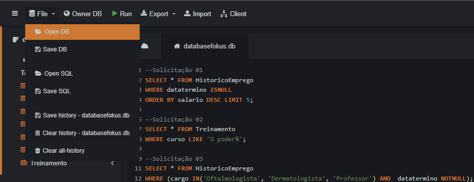
</div>

## 📝 Conhecendo o Banco de Dados

Em nosso Banco de Dados temos um breve resumo das tabelas:

📂 HistoricoEmprego - Tabela que registra a trajetória de cada colaborador na empresa.<br>
👨🏻‍💼 Colaboradores - Tabela que contém as informações pessoais de cada colaborador.<br>
🏠 Dependentes - Tabela que armazena informações sobre os dependentes de cada colaborador.<br>
💰 Faturamento - Tabela que registra as informações financeiras da Fokus, como lucro e despesas.<br>
📝 Licenças - Tabela que controla licenças e férias dos colaboradores, incluindo tipos de licença, períodos.<br>
🚀 Treinamento - Tabela de treinamentos oferecidos por instituições parceiras, incluindo cursos e instituições.<br>

## 💡 Desenvolvimento

A empresa RH Fokus realizou as solicitações abaixo, segue abaixo o procedimento, código e resultado das soluções:

---

> 01 - "Precisamos dos 5 Colaboradores hoje, que estão no atuando no mercado, com as melhores remunerações.<br>
> Queremos reunir depoimentos inspiradores para atrair novos talentos e motivar os atuais."

<details><summary>Solução 01:</summary>

Para identificar os 5 colaboradores com as melhores remunerações e que ainda estão atuando no mercado:<br>
Selecionei (`SELECT`) todos os registros, que estão (`FROM`) na tabela 'HistoricoEmprego,<br>
Onde (`WHERE`) está a coluna 'datatermino', busquei os colaboradores ativos do mercado,<br>
Ou seja, sem data de término (`ISNULL`),<br>
Ordenei (`ORDER BY`) os resultados pelo salário em ordem decrescente (`DESC`),<br>
Limitando (`LIMIT`) a seleção aos 5 primeiros.<br>

- Código SQL:

```
SELECT * FROM HistoricoEmprego
WHERE datatermino ISNULL
ORDER BY salario DESC LIMIT 5;
```

- Resultado:
<div>
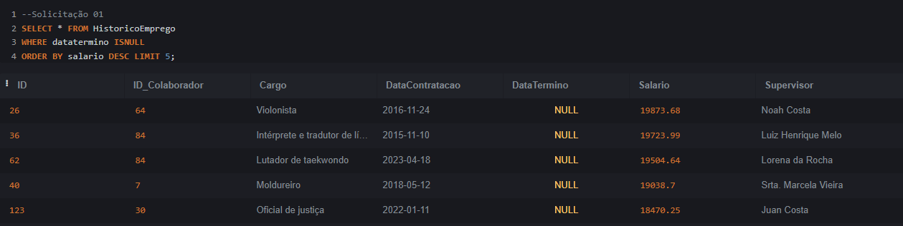
</div>

</details>
<br>

---

> 02 - "Um colaborador de um dos nossos clientes comentou que fez um treinamento especifico que ele achou muito interessante. Porém a única pista que temos é que esse treinamento começa com: "O poder.. ", e está listado na tabela de Treinamento. Quais treinamentos poderiam se encaixar nessa descrição?"

<details><summary>Solução 02:</summary>

Para identificar esse treinamento apenas com essa pista:<br>
Selecionei (`SELECT`) todos os registros, que estão (`FROM`) na tabela 'Treinamento',<br>
Onde (`WHERE`) está a coluna 'curso', busquei os registros que contenha (`LIKE`) a palavra-chave: "O poder%".<br>
O símbolo (`%`) é utilizado para permitir a busca por qualquer sequência de caracteres após "O poder.. ".<br>

- Código SQL:

```
SELECT * FROM Treinamento
WHERE curso LIKE 'O poder%';
```

- Resultado:
<div>
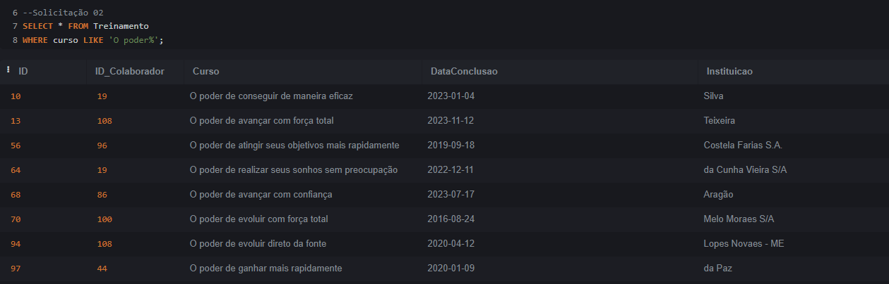
</div>

</details>
<br>

---

> 03 - "Estamos em busca de colaboradores para cargos específicos, visando preencher algumas vagas.<br>
> A primeira delas é para o cargo de Professor, enquanto a segunda se destina a um profissional na área de Oftalmologia ou Dermatologia."

<details><summary>Solução 03:</summary>

Para identificar esses colaboradores:<br>
Selecionei (`SELECT`) todos os registros, que estão (`FROM`) na tabela 'HistoricoEmprego',<br>
Onde (`WHERE`) está a coluna 'cargo',<br>
Busquei os registros que possuem (`IN`) os cargos: Oftalmologista, Dermatologista e Professor.<br>
E (`AND`) da coluna 'datatermino', busquei colaboradores inativos do mercado,<br>
Ou seja, com data de término (`NOTNULL`).<br>

- Código SQL:

```
SELECT * FROM HistoricoEmprego
WHERE (cargo IN('Oftalmologista', 'Dermatologista', 'Professor') AND  datatermino NOTNULL);
```

- Resultado:
<div>
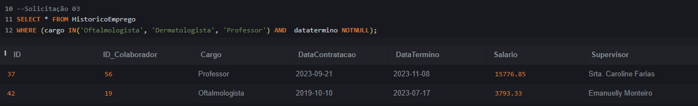
</div>

</details>
<br>

---

> 04 - "Gostaríamos de encontrar 2 treinamentos específicos, para recomendarmos a um novo colaborador:<br>
> O primeiro treinamento, oferecido pela instituição 'Da Rocha', tem início com 'O direito...'. <br>
> Enquanto o segundo curso, ministrado pela instituição 'Das Neves', inicia com 'O conforto...'."

<details><summary>Solução 04:</summary>

Para identificar esses dois treinamentos :<br>
Selecionei (`SELECT`) todos os registros, que estão (`FROM`) na tabela 'Treinamento',<br>
Onde (`WHERE`) está a coluna 'curso':<br>
Busquei os registros que contenha (`LIKE`) a palavra-chave: "O direito%",<br>
E (`AND`) a instituição igual a "da Rocha", ou (`OR`),<br>
Busquei os registros que contenha (`LIKE`) a palavra-chave: "O conforto%",<br>
E (`AND`) a instituição igual a "das Neves".<br>

- Código SQL:

```
SELECT * FROM Treinamento
WHERE (curso LIKE 'O direito%' AND instituicao = 'da Rocha')
OR (curso LIKE 'O conforto%' AND instituicao = 'das Neves');
```

- Resultado:
<div>
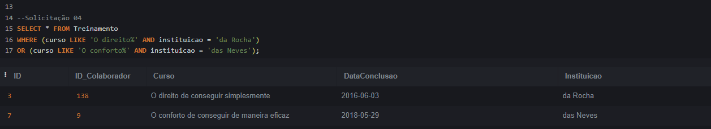
</div>

</details>
<br>

---

> 05 - "Estamos em Auditoria esse mês, e precisamos do levantamento de algumas informações com relação ao faturamento. Precisamos saber, quais os meses de maior e menor faturamento na história da empresa."

<details><summary>Solução 05:</summary>

Para identificar os meses de maior e menor faturamento:<br>
Selecionei (`SELECT`) a coluna 'mes' e realizamos o cálculo do maior (`MAX`) e menor (`MIN`) valores,<br>
Valores esses da coluna 'faturmento_bruto',<br>
Utilizei (`AS`) para atribuir um nome alternativo as colunas, no caso: 'Maiorfaturamento' e 'Menorfaturamento",<br>
Facilitando o entendimento, coluna essa que está (`FROM`) na tabela 'faturamento'.<br>

- Código SQL:

```
SELECT mes, MAX(faturamento_bruto) AS Maiorfaturamento FROM faturamento;
SELECT mes, MIN(faturamento_bruto) AS Menorfaturamento FROM faturamento;
```

- Resultado:

<div>
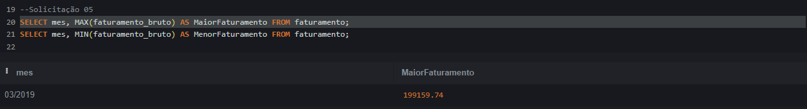
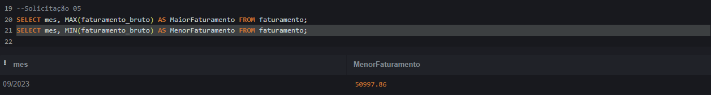
</div>

</details>
<br>

---

> 06 - "Precisamos saber qual a soma de novos clientes tivemos no ano de 2023, para acompanhar o crescimento da base de clientes."

<details><summary>Solução 06:</summary>

Para realizarmos a soma de novos clientes do ano de 2023:<br>
Selecionei (`SELECT`) e realizei o cálculo de soma (`SUM`) da coluna 'numero_novos_clientes',<br>
Utilizei (`AS`) para atribuir um nome alternativo a coluna, no caso: 'Novos Clientes 2023',<br>
Facilitando o entendimento, coluna essa que está (`FROM`) na tabela 'faturamento'.<br>
Onde (`WHERE`) está a coluna 'mes', busquei os registros que contenha (`LIKE`) o ano em questão: "%2023".<br>
O símbolo (`%`) é utilizado para permitir a busca por qualquer sequência de caracteres antes do ano "..2023".<br>

- Código SQL:

```
SELECT SUM(numero_novos_clientes) AS 'Novos Clientes 2023' FROM faturamento
WHERE mes LIKE '%2023';
```

- Resultado:

<div>
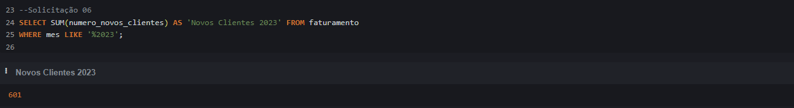
</div>

</details>
<br>

---

> 07 - "Qual a média do lucro e despesas? precisamos avaliar o desempenho financeiro da empresa."

<details><summary>Solução 07:</summary>

Para realizarmos o cálculo de média do lucro e despesas:<br>
Selecionei (`SELECT`) e realizamos o cálculo da média (`AVG`) da coluna 'despesas' e 'lucro_liquido',<br>
Assim como realizei o arrendondamento do valor (`ROUND`) para duas casas decimais.<br>
Utilizei (`AS`) para atribuir um nome alternativo a coluna, no caso: 'MediaDespesas'e 'MediaLucroLiquido',<br>
Facilitando o entendimento, coluna essa que está (`FROM`) na tabela 'faturamento'.<br>

- Código SQL:

```
SELECT ROUND(AVG(despesas),2) AS MediaDespesas FROM faturamento;
SELECT ROUND(AVG(lucro_liquido),2) AS MediaLucroLiquido FROM faturamento;
```

- Resultado:

<div>
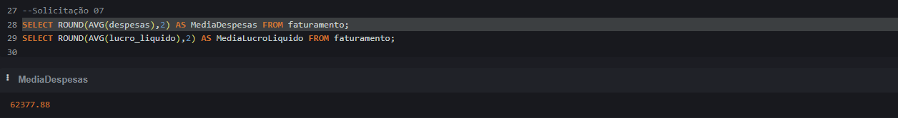
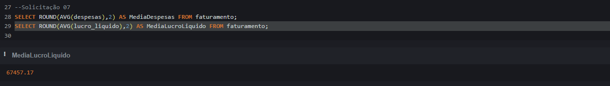
</div>

</details>
<br>

---

> 08 - "Qual a quantidade de profissionais que estão desempregados e de férias?<br>
> Necessitamos compreender a disponibilidade da força de trabalho."

<details><summary>Solução 08:</summary>

Para sabermos a quantidade de profissionais desempregados e de férias:<br>
Selecionei (`SELECT`) e realizei a contagem (`COUNT`) de todos os registros,<br>
Utilizei (`AS`) para atribuir um nome alternativo a coluna,<br>
No caso: 'ProfissionaisDesempregados' e 'ProfissionaisFérias' facilitando o entendimento,<br>
Coluna essa que está (`FROM`) na tabela 'HistoricoEmprego'.<br>

Para quem está desempregado: <br>
Onde (`WHERE`) está a coluna 'datatermino', busquei colaboradores inativos do mercado,<br>
Ou seja, com data de término (`NOTNULL`),<br>
Para quem está de férias: <br>
Onde (`WHERE`) está a coluna 'tipolicenca', busquei os registros que são igual a 'férias'.<br>

- Código SQL:

```
SELECT COUNT(*) AS QtdProfissionaisDesempregados FROM HistoricoEmprego
WHERE datatermino NOTNULL;

SELECT COUNT(*) AS QtdProfissionaisFérias FROM Licencas
WHERE tipolicenca = 'férias';
```

- Resultado:

<div>
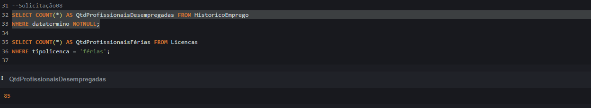
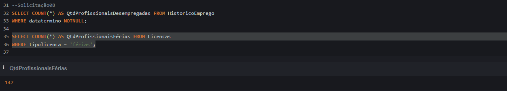
</div>

</details>
<br>

---

> 09 - "Precisamos da listagem de todos os tipos de parentesco existente que temos.<br>
> Gostariamos de entender a diversidade de perfis familiares dos colaboradores para possíveis ações de suporte ou benefícios."

<details><summary>Solução 09:</summary>

Para sabermos a listagem de todos os tipos de parentesco existentes:<br>
Selecionei (`SELECT`) a coluna 'parentesco' e realizei a contagem (`COUNT`) de todos os registros,<br>
Utilizei (`AS`) para atribuir um nome alternativo a coluna, no caso: 'QtdTipoParentesco',<br>
Facilitando o entendimento, coluna essa que está (`FROM`) na tabela 'Dependentes'.<br>
Logo depois agrupei (`GROUP BY`) pela coluna 'parentesco', para trazer a contagem por cada tipo de parentesco.<br>

- Código SQL:

```
SELECT parentesco, COUNT(*) AS 'QtdTipoParentesco' FROM Dependentes
GROUP BY parentesco;
```

- Resultado:

<div>
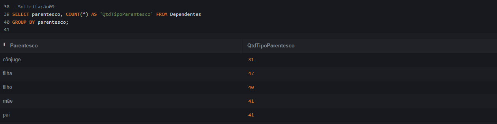
</div>

</details>
<br>

---

> 10 - "Quais as instituições cadastradas que mais possuem cursos ? <br>
> Precisamos direcionar parcerias estratégicas para ampliar as opções de qualificação aos candidatos."

<details><summary>Solução 10:</summary>

Para sabermos quais instituições possuem mais cursos:<br>
Selecionei (`SELECT`) a coluna 'instituicao' e realizei a contagem (`COUNT`) dos registros da coluna 'curso',<br>
Utilizei (`AS`) para atribuir um nome alternativo a coluna, no caso: 'QtdCurso',<br>
Facilitando o entendimento, coluna essa que está (`FROM`) na tabela 'Treinamento'.<br>
Logo depois agrupei (`GROUP BY`) pela coluna 'instituicao', para trazer a contagem por cada tipo de instituição.<br>
Utilizei o (`HAVING`), filtro especial para grupos, buscando registros onde a contagem (`COUNT`) dos registros da coluna 'curso' seja superior a 2, trazendo as instituições com mais cursos.<br>

- Código SQL:

```
SELECT instituicao, COUNT(curso) AS QtdCurso FROM Treinamento
GROUP BY instituicao HAVING COUNT(curso) > 2;
```

- Resultado:

<div>
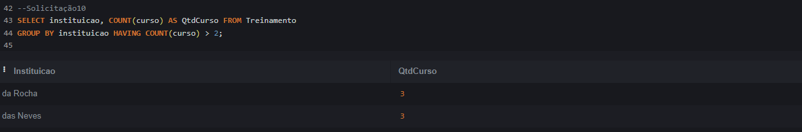
</div>

</details>
<br>

---

> 11 - "Qual as profissões mais cadastradas em nosso banco de dados referente aos cargos ? <br>
> Precisamos dessa informação para procurar empresas que já tenham essas vagas disponíveis para apoiar os colaboradores."

<details><summary>Solução 11:</summary>

Para sabermos quais as profissões mais cadastradas no banco de dados:<br>
Selecionei (`SELECT`) a coluna 'cargo' e realizei a contagem (`COUNT`) de todos os registros,<br>
Utilizei (`AS`) para atribuir um nome alternativo a coluna, no caso: 'QtdCargo',<br>
Facilitando o entendimento, coluna essa que está (`FROM`) na tabela 'HistoricoEmprego'.<br>
Logo depois agrupei (`GROUP BY`) pela coluna 'cargo', para trazer a contagem por cada tipo de profissão.<br>
Utilizei o (`HAVING`), filtro especial para grupos, buscando registros onde 'QtdCargo'seja igual ou superior a 2, trazendo as profissões mais cadastradas.<br>

- Código SQL:

```
SELECT cargo, COUNT(*) AS 'QtdCargo' FROM HistoricoEmprego
GROUP BY cargo HAVING QtdCargo >= 2
```

- Resultado:

<div>
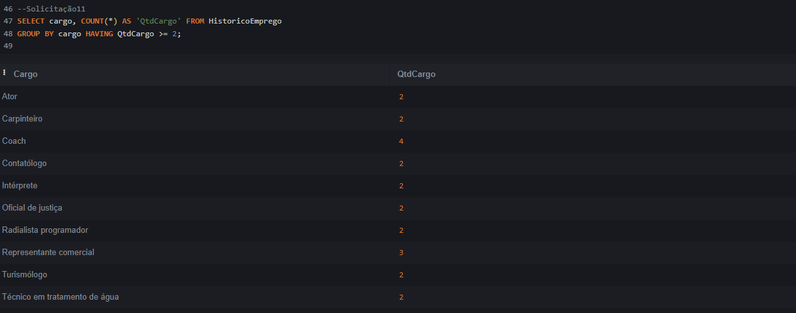
</div>

</details>
<br>

---

> 12 - "Gostaríamos que vocês confirmasse que todos os CPF's dos colaboradores estão corretos.<br>
> Eles estão cadastrados corretamente com os 11 dígitos do CPF?"

<details><summary>Solução 12:</summary>

Para sabermos se os CPF's foram cadastrados corretamente com 11 dígitos:<br>
Selecionei (`SELECT`) e realizei a contagem (`COUNT`) de todos os registros,<br>
Assim como realizei a verificação do comprimento (`LENGTH`) da coluna 'cpf',<br>
Utilizei (`AS`) para atribuir um nome alternativo a coluna, no caso: 'QtdDigitos',<br>
Facilitando o entendimento, coluna essa que está (`FROM`) na tabela 'Colaboradores'.<br>
E verificamos que todos os 150 registros da tabela estão corretos com 11 dígitos:

- Código SQL:

```
SELECT COUNT(*), LENGTH(cpf) AS 'QtdDigitos' FROM Colaboradores
```

- Resultado:

<div>
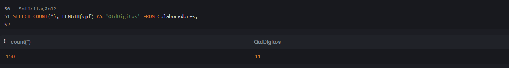
</div>

</details>
<br>

---

> 13 - "Nosso Diretor pediu para ver os dados das pessoas Colaboradoras de uma forma mais dinâmica, não pode parecer com uma tabela.
> Ele precisa de duas versões: uma toda em maiúsculo para títulos de e-mail, e outra em Minuscula para usar como texto."

<details><summary>Solução 13:</summary>

Para atender a solicitação do Diretor e realizar essa visualização dinâmica com o texto em maiúscula ou minuscula:<br>
Selecionei (`SELECT`) e transformei nosso texto em maiúscula ou minúscula (`UPPER` ou `LOWER`),
Informando sempre o texto que desejamos passar entre '' e concatenando texto com os valores das colunas (`||`),<br>
Utilizei (`AS`) para atribuir um nome alternativo a coluna, no caso: 'TextoMaior' ou 'TextoMenor',<br>
Facilitando o entendimento, coluna essa que está (`FROM`) na tabela 'Colaboradores'.<br>

- Código SQL:

```
SELECT UPPER('A pessoa colaboradora ' || nome || ' de CPF ' || cpf || ' possui o seguinte Endereço:  ' || endereco) AS TextoMaior from Colaboradores
SELECT LOWER('A pessoa colaboradora ' || nome || ' de CPF ' || cpf || ' possui o seguinte Endereço:  ' || endereco) AS TextoMenor from Colaboradores
```

- Resultado:

<div>
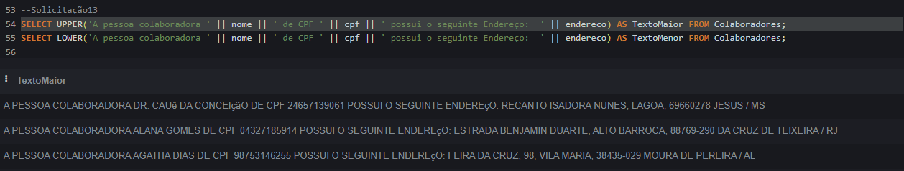
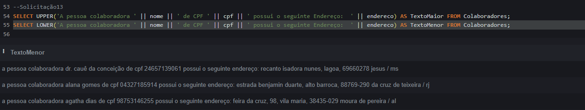
</div>

</details>
<br>

---

> 14 - "Referente a data inicio de licença dos colaboradores, precisamos da informação apenas do Ano e Mês correspondente.
> Isso irá simplificar nossa análise e evitar informações desnecessárias, como o dia específico do início da licença."

<details><summary>Solução 14:</summary>

Para retornarmos a eles apenas o mês e ano da data inicio de licença dos colaboradores:<br>
Selecionei (`SELECT`) a coluna 'id_colaborador' e realizei a formatação solicitada (`STRFTIME`),<br>
Pelo ano (`%Y`) e mês (`%m`) da coluna 'datainicio',<br>
Utilizei (`AS`) para atribuir um nome alternativo a coluna, no caso: 'MêsAno',<br>
Facilitando o entendimento, coluna essa que está (`FROM`) na tabela 'Licencas'.<br>

- Código SQL:

```
SELECT id_colaborador, STRFTIME('%Y/%m', datainicio) AS 'MêsAno' FROM Licencas;
```

- Resultado:

<div>
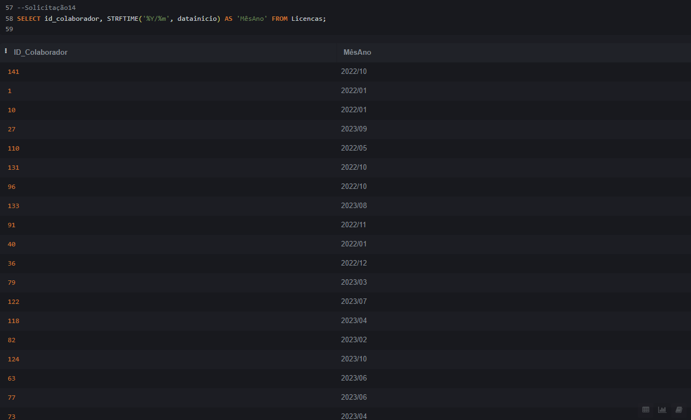
</div>

</details>
<br>

---

> 15 - "Qual o intervalo de tempo cada colaborador inativo, ficou no contrato, conforme cadastrado na base de dados ?
> Gostaríamos de atuar no contato com eles de forma mais efetiva."

<details><summary>Solução 15:</summary>

Para retornarmos a informação de intervalo de tempo para cada colaborador:<br>
Selecionei (`SELECT`) a realizamos o cálculo do dia juliano (`JULIANDAY`) da 'datatermino' menos 'datacontratacao',<br>
Utilizei (`AS`) para atribuir um nome alternativo a coluna, no caso: 'IntervaloDias',<br>
Facilitando o entendimento, coluna essa que está (`FROM`) na tabela 'HistoricoEmprego'.<br>
Onde (`WHERE`) está a coluna 'datatermino', busquei colaboradores inativos do mercado,<br>
Ou seja, com data de término (`NOTNULL`),<br>

- Código SQL:

```
SELECT id_colaborador,  (datatermino) - JULIANDAY (datacontratacao) AS IntervaloDias FROM HistoricoEmprego
WHERE datatermino NOTNULL;
```

- Resultado:

<div>
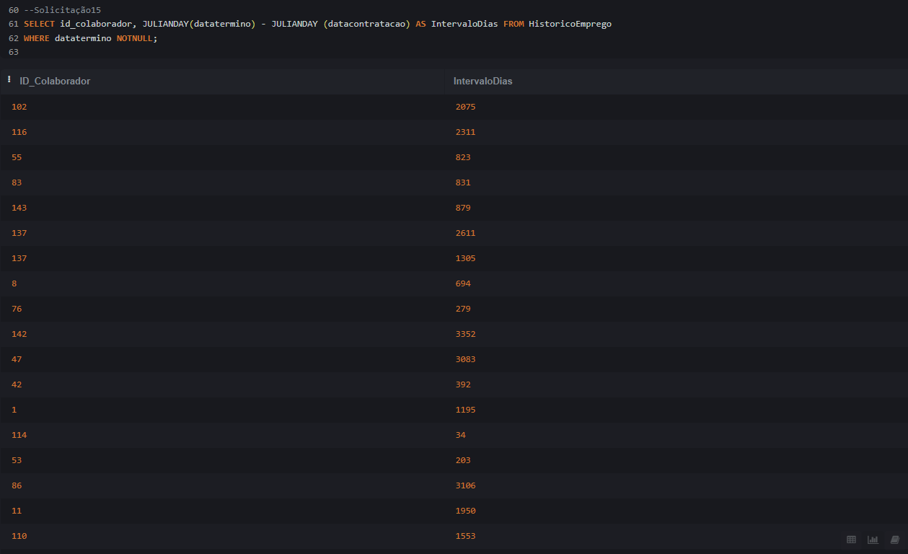
</div>

</details>
<br>

---

> 16 - "Desejamos ver a informação do faturamento bruto médio no formato de uma frase.
> Isso irá facilitar a compreensão da informação e permitir seu uso em apresentações ou relatórios de forma mais amigável."

<details><summary>Solução 16:</summary>

Para retornarmos a informação do faturamento bruto médio no formato de uma frase:<br>
Selecionei (`SELECT`) informando sempre o texto que desejamos passar entre '',<br>
E concatenando texto com os valores das colunas (`||`),<br>
Realizei o cálculo da média (`AVG`) da coluna 'faturamento_bruto,<br>
Assim como o arrendondamento do valor (`ROUND`) para duas casas decimais, retornando o (`TEXT`),<br>
Utilizei (`AS`) para atribuir um nome alternativo a coluna, no caso: 'MédiaFatBruto',<br>
Facilitando o entendimento, coluna essa que está (`FROM`) na tabela 'faturamento'.<br>

- Código SQL:

```
SELECT ('O Faturamento Bruto Médio foi ' || CAST(ROUND(AVG(faturamento_bruto),2) AS TEXT)) AS MédiaFatBruto FROM faturamento;
```

- Resultado:

<div>

</div>

</details>
<br>

---

> 17 - "Queremos realizar um novo projeto e para isso precisamos separar os colaboradores por Faixa Salarial."

<details><summary>Solução 17:</summary>

Para retornarmos a informação separando os colaboradores por faixa salarial:<br>
Selecionei (`SELECT`) as colunas: 'id_colaborador', 'cargo' e 'salario', e avaliamos a condição (`CASE`),<br>
Quando (`WHEN`) a coluna 'salario' for menor (`<`) que 3000 então (`THEN`) será classificado como 'Baixo',<br>
Quando (`WHEN`) a coluna 'salario' estiver entre (`BETWEEN`) 3000 e (`AND`) 6000 então (`THEN`) será 'Médio',<br>
Qualquer outra condição (`ELSE`), no caso se for maior que 6000 ele irá ser 'Alto',<br>
Marcando o final da nossa condição (`END`),<br>

Utilizei (`AS`) para atribuir um nome alternativo a coluna, no caso: 'categoria_salario',<br>
Facilitando o entendimento, coluna essa que está (`FROM`) na tabela 'HistoricoEmprego'.<br>

- Código SQL:

```
SELECT id_colaborador, cargo, salario,
CASE
WHEN salario < 3000 then 'Baixo'
WHEN salario BETWEEN 3000 and 6000 then 'Médio'
ELSE 'Alto'
end as categoria_salario
from HistoricoEmprego;
```

- Resultado:

<div>
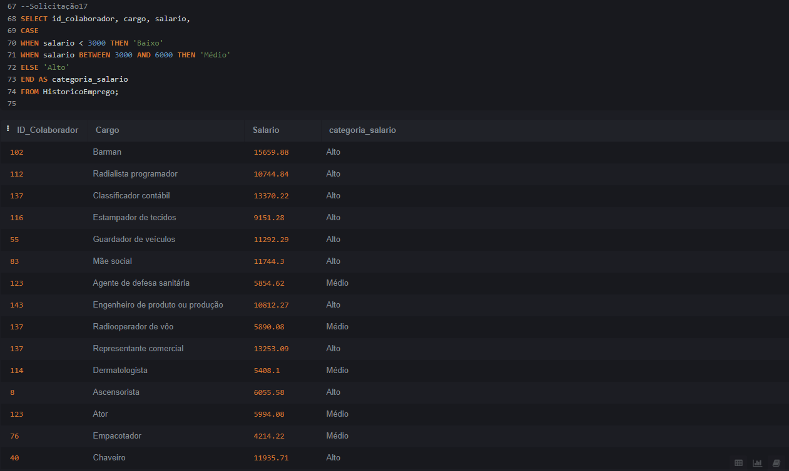
</div>

</details>
<br>

---

> 18 - "Conversamos internamente, e decidimos mudar a tabela "Histórico Emprego", para "Cargo Colaboradores",
> Pois entendemos que irá fazer mais sentido ao negócio."

<details><summary>Solução 18:</summary>

Para alterarmos o nome da tabela solicitada:<br>
Alteramos (`ALTER`) a tabela 'HistoricoEmprego' renomeando (`RENAME`) para (`TO`) 'Cargos Colaboradores.

- Código SQL:

```
ALTER TABLE HistoricoEmprego RENAME TO CargosColaboradores;
```

- Resultado:

<div>
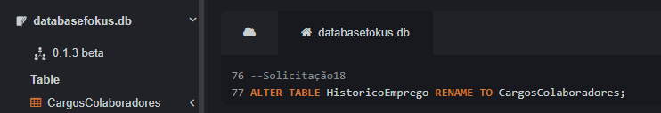
</div>

</details>
<br>

---

## 📚 Conhecimentos

Para estudo e aplicação do projeto, Utilizei os conteúdos:

- [SQLite Online: executando consultas SQL](https://cursos.alura.com.br/course/sqlite-online-executando-consultas-sql)

## 🤖 Tecnologias

<div style="display: flex">
  
</div>

---

- `SQL`: O SQL é a linguagem de programação utilizada para gerenciamento e consulta de Banco de Dados Relacionais, permitindo: Criar, Ler, Atualizar e Deletar (CRUD "Create","Read", "Update" e "Delete").

---

**Desenvolvido por [Rodrigo Moraes](https://github.com/rodrigomoraesdev)**
